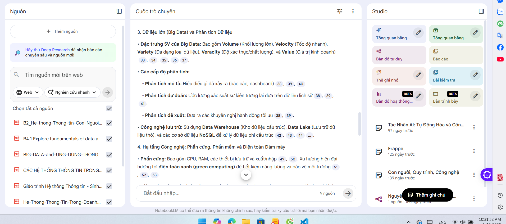

1. Chức năng upload

Dưới đây là **bản format lại phần yêu cầu bổ sung** theo  **chuẩn tài liệu yêu cầu hệ thống (Functional + Technical Requirements)** , thống nhất ngôn ngữ và cấu trúc để bạn có thể đưa trực tiếp vào **SRS / PRD / Design Doc** cho project  **NotebookLM-like** .

---

# Yêu cầu bổ sung – Quản lý file & Ingestion dữ liệu

## 1. Cơ chế upload file

### 1.1. Tự động upload khi chọn file

**Mô tả**

* Khi người dùng chọn file từ máy (file picker), hệ thống **tự động bắt đầu upload ngay**
* Không yêu cầu thao tác click nút “Upload”

**Yêu cầu kỹ thuật**

* Trigger upload ngay tại sự kiện `onChange` của file input
* Hiển thị trạng thái:
  * uploading
  * processing
  * indexed
  * failed

---

### 1.2. Upload nhiều file song song

**Mô tả**

* Cho phép chọn **nhiều file trong một lượt**
* Các file được upload  **song song** , không upload tuần tự

**Yêu cầu kỹ thuật**

* Frontend: gửi nhiều request upload đồng thời
* Backend:
  * Xử lý mỗi file trong một task / worker độc lập
  * Không block request chính
* Cho phép retry từng file riêng biệt khi lỗi

---

## 2. Chức năng xóa file

### 2.1. Xóa file không ảnh hưởng trải nghiệm người dùng

**Mô tả**

* Khi người dùng yêu cầu xóa file:
  * UI phản hồi ngay (optimistic UI)
  * Hệ thống chạy **luồng xóa ngầm (background deletion)**

**Phạm vi xóa**

* Metadata file trong database
* Các chunk liên quan
* Vector trong FAISS
* File gốc trên storage (S3 / local)

**Yêu cầu kỹ thuật**

* Xóa bất đồng bộ (background task)
* Không khóa session người dùng
* Có thể theo dõi trạng thái xóa (pending / completed / failed)

---

## 3. Chọn file làm nguồn trả lời (Scoped Retrieval)

### 3.1. Lọc nguồn theo file được chọn

**Mô tả**

* Người dùng có thể **chọn một hoặc nhiều file**
* Phần trả lời chỉ sử dụng nội dung từ các file đã chọn

**Yêu cầu kỹ thuật**

* Retrieval layer nhận thêm tham số:
  ```
  allowed_file_ids: List[str]
  ```
* FAISS search kết hợp filter theo `file_id`
* Source citation chỉ trả về từ các file được chọn

**Mục tiêu**

* Tăng độ chính xác
* Tránh lẫn nội dung giữa các tài liệu không liên quan

---

## 4. Xử lý nhiều loại dữ liệu đầu vào (Ingestion Strategy)

Hệ thống cần tự động phân loại và xử lý tài liệu theo chất lượng và cấu trúc dữ liệu đầu vào.

---

### 4.1. PDF thuần text (Text-based PDF)

**Dấu hiệu**

* Có thể copy/paste nội dung
* PDF parser trả về text đầy đủ, ổn định

**Chiến lược xử lý**

* Parse text trực tiếp
* Không sử dụng OCR
* Chunk → embedding → lưu DB + FAISS

**Lưu ý**

* Giữ heading để chunk theo ngữ nghĩa tốt hơn

---

### 4.2. PDF scan (toàn bộ là ảnh)

**Dấu hiệu**

* Không copy được nội dung
* Parser trả về empty hoặc rất ít text

**Chiến lược xử lý**

* OCR toàn bộ document
* Chunk text OCR
* Tạo embedding

**Công cụ**

* Tesseract OCR (free)

---

### 4.3. PDF hỗn hợp (Text + Image) — *Case phổ biến nhất*

**Dấu hiệu**

* Có text nhưng:
  * Rất ngắn
  * Thiếu nội dung chính
  * Có nhiều ảnh hoặc bảng

**Chiến lược xử lý**

1. Parse text trước
2. Đánh giá chất lượng text theo trang
3. OCR **chọn lọc theo trang**
4. Merge nội dung:
   ```
   final_text = parsed_text + ocr_text
   ```
5. Chunk → embedding → lưu trữ

---

### 4.4. PDF chứa bảng, sơ đồ, hình ảnh mang nội dung

**Dấu hiệu**

* Parser bỏ sót thông tin quan trọng
* Nội dung text không đủ ngữ nghĩa

**Chiến lược xử lý**

* OCR các trang có bảng / sơ đồ / hình lớn
* Không phụ thuộc hoàn toàn vào parser
* Ưu tiên **recall hơn precision** (phù hợp RAG)

---

### 4.5. File ảnh (JPG / PNG)

**Dấu hiệu**

* Không tồn tại text layer

**Chiến lược xử lý**

* OCR 100% nội dung ảnh
* Có thể tiền xử lý ảnh (resize, denoise)
* Chunk → embedding → lưu trữ

---

### 4.6. File Word / HTML / Markdown

**Dấu hiệu**

* Có cấu trúc rõ ràng (heading, section)

**Chiến lược xử lý**

* Parse trực tiếp
* Không OCR
* Chunk theo heading / section

## Cơ chế load FILE UI

Auto refresh để luôn đồng bộ. Không cần phải nhấn nút refresh

## Chức năng hover hiển thị thêm thông tin

# Chức năng Hover hiển thị thông tin nguồn (Source Hover Preview)

## 1. Mục tiêu chức năng

Chức năng này nhằm:

* Minh bạch hóa nguồn dữ liệu được AI sử dụng khi trả lời
* Giúp người dùng **xác minh, truy vết và hiểu ngữ cảnh** của từng câu trả lời
* Tạo trải nghiệm tương tác tương tự **NotebookLM (Google)** trong hệ thống RAG

---

## 2. Hành vi tổng quan

Khi AI trả lời câu hỏi:

* Các đoạn nội dung được trích dẫn từ tài liệu sẽ được **đánh số nguồn** (ví dụ: [1], [2], [3])
* Người dùng **di chuột (hover)** vào số nguồn
* Hệ thống hiển thị **tooltip / popover** chứa thông tin chi tiết của đoạn tài liệu tương ứng

---

## 3. Cách hiển thị nguồn trong câu trả lời

### 3.1. Dạng hiển thị trong text trả lời

Ví dụ:

> Mô hình Transformer lần đầu được giới thiệu vào năm 2017 [1] và đã tạo ra bước đột phá trong NLP [2].

Trong đó:

* `[1]`, `[2]` là **Source Index**
* Mỗi index ánh xạ tới **1 chunk tài liệu cụ thể khi hover vào**

---

## 4. Nội dung hiển thị khi hover

Khi hover vào `[n]`, hiển thị **Source Detail Panel** với các thông tin sau:

### 4.1. Thông tin bắt buộc

| Trường                              | Mô tả                              |
| ------------------------------------- | ------------------------------------ |
| **Tên file**                   | Tên tài liệu gốc                 |
| **Số trang**                   | `page_start – page_end`           |
| **Tiêu đề đoạn**(nếu có) | Heading / section title              |
| **Nội dung trích đoạn**     | Text chunk đã dùng để trả lời |
| **Độ liên quan**(optional)   | Similarity score / ranking           |

Ví dụ hiển thị:

<pre class="overflow-visible! px-0!" data-start="1560" data-end="1758"><div class="contain-inline-size rounded-2xl corner-superellipse/1.1 relative bg-token-sidebar-surface-primary"><div class="sticky top-[calc(--spacing(9)+var(--header-height))] @w-xl/main:top-9"><div class="absolute end-0 bottom-0 flex h-9 items-center pe-2"><div class="bg-token-bg-elevated-secondary text-token-text-secondary flex items-center gap-4 rounded-sm px-2 font-sans text-xs"></div></div></div><div class="overflow-y-auto p-4" dir="ltr"><code class="whitespace-pre!"><span><span>Ngu</span><span>ồ</span><span>n</span><span></span><span>[</span><span>1</span><span>]</span><span>
📄 </span><span>transformer</span><span>.</span><span>pdf</span><span>
📄 </span><span>Trang</span><span>:</span><span></span><span>3</span><span> – </span><span>4</span><span>

</span><span>Ti</span><span>ê</span><span>u</span><span> đề</span><span>:</span><span>
</span><span>Attention</span><span></span><span>Is</span><span></span><span>All</span><span></span><span>You</span><span></span><span>Need</span><span>

</span><span>Tr</span><span>í</span><span>ch</span><span> đ</span><span>o</span><span>ạ</span><span>n</span><span>:</span><span>
</span><span>"The Transformer is a novel neural network architecture based solely on attention mechanisms..."</span></span></code></div></div></pre>

---

## Tổng kết yêu cầu hệ thống

| Nhóm chức năng |  | Yêu cầu chính                 |
| ----------------- | - | -------------------------------- |
| Upload            |  | Auto upload, song song           |
| Xóa file         |  | Bất đồng bộ, không block UI |
| Retrieval         |  | Lọc theo file được chọn     |
| Ingestion         |  | Tự động phân loại & xử lý |
| OCR               |  | Toàn bộ hoặc chọn lọc       |
| Chunking          |  | Theo ngữ nghĩa                 |
| Auto refresh file |  |                                  |

---

Nếu bạn muốn, tôi có thể tiếp tục:

* Chuyển phần này thành **Use Case Diagram**
* Viết **API contract cho upload / delete / retrieve**
* Đề xuất **queue + worker architecture** (Celery / BackgroundTasks)
* Chuẩn hóa thành **PRD hoàn chỉnh cho NotebookLM-like**

## * UPDATE PHẦN UI GIỐNG VỚI NOTEBOOKLM


